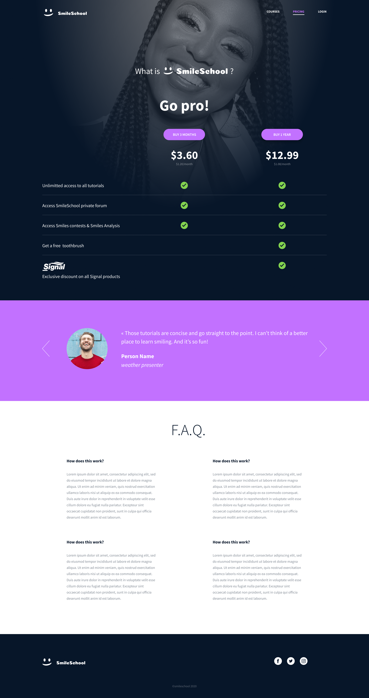
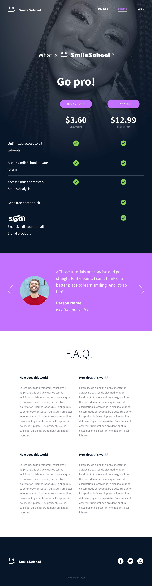
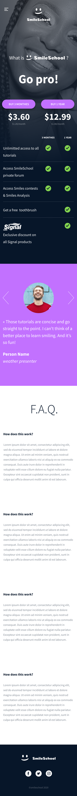
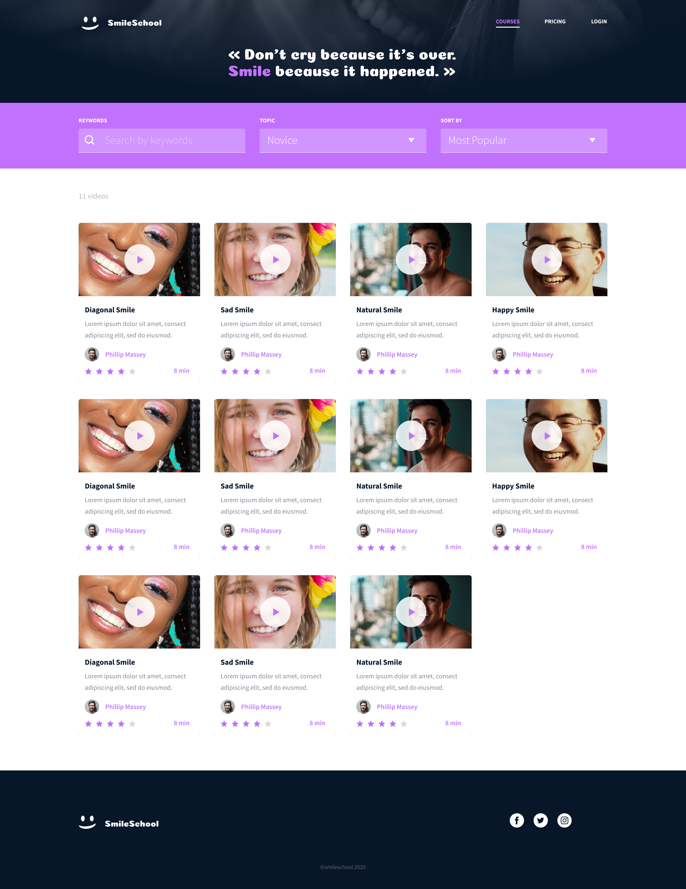
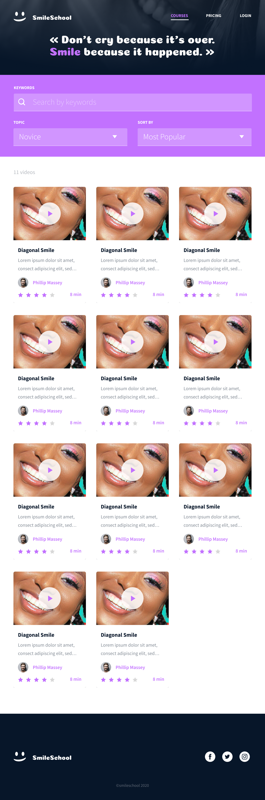
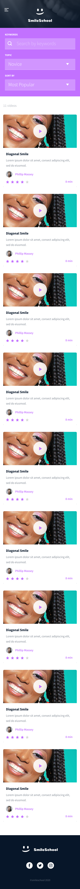

<!-- PROJECT LOGO -->
 
 

  

 
 

<!-- ABOUT THE PROJECT -->
## About The Project

 

  This project is about building a website with just html, css, bootstrap and javascript by following a Figma design project.

 

### Built With

* [HTML](https://en.wikipedia.org/wiki/HTML)

* [CSS](https://en.wikipedia.org/wiki/CSS)

* [BOOTSTRAP](https://en.wikipedia.org/wiki/Bootstrap_(front-end_framework))

* [JAVASCRIPT](https://en.wikipedia.org/wiki/JavaScript)

### WEB-PAGE 1

<table align=center width=100%>
  <tr>
    <td>Desktop view</td>
    <td>Tablet view </td>
    <td>Mobile view</td>
  </tr>
  <tr>
    <td></td>
     <td></td>
    <td></td>
  </tr>
 </table>

### WEB-PAGE 2

<table align=center width=100%>
  <tr>
    <td>Desktop view</td>
    <td>Tablet view </td>
    <td>Mobile view</td>
  </tr>
  <tr>
    <td></td>
     <td></td>
    <td></td>
  </tr>
 </table>

 ### WEB-PAGE 3

<table align=center width=100%>
  <tr>
    <td>Desktop view</td>
    <td>Tablet view </td>
    <td>Mobile view</td>
  </tr>
  <tr>
    <td></td>
     <td></td>
    <td></td>
  </tr>
 </table>